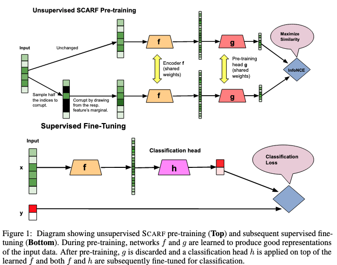

# Pytorch-Scarf

Implementation of [SCARF: Self-Supervised Contrastive Learning using Random Feature Corruption](https://arxiv.org/abs/2106.15147) in Pytorch.

The model learns a representation of tabular data using contrastive learning. It is inspired from SimCLR and uses a similar architecture and loss.

# Install

Clone the repo

```git clone https://github.com/clabrugere/pytorch-scarf.git```

or install from the repo

```pip install git+https://github.com/clabrugere/pytorch-scarf.git```

# Usage

``` python
from scarf.loss import NTXent
from scarf.model import SCARF


# preprocess your data and create your pytorch dataset
# train_ds = ...

# train the model
batch_size = 128
epochs = 5000
device = torch.device("cuda" if torch.cuda.is_available() else "cpu")

train_loader = DataLoader(train_ds, batch_size=batch_size, shuffle=True)

model = SCARF(
    input_dim=train_ds.shape[1],
    emb_dim=16,
    features_low=train_ds.features_low,
    features_high=train_ds.features_high,
    corruption_rate=0.6,
    dropout=0.1
).to(device)

optimizer = Adam(model.parameters(), lr=0.001, weight_decay=1e-4)
ntxent_loss = NTXent()

loss_history = []

for epoch in range(1, epochs + 1):
    epoch_loss = 0.0
    for x in train_loader:
        x = x.to(device)
        emb_anchor, emb_positive = model(x)

        loss = criterion(emb_anchor, emb_positive)
        loss.backward()

        optimizer.step()
        optimizer.zero_grad()
        epoch_loss += loss.item()

  loss_history.append(epoch_loss)

  if epoch % 100 == 0:
    print(f"epoch {epoch}/{epochs} - loss: {loss_history[-1]:.4f}")
```

For more details, refer to the example notebook `example/example.ipynb` and how to supply samples to the model in `example/dataset.py`

# SCARF



This model builds embeddings of tabular data in a self-supervised fashion similarly to SimCLR using a contrastive approach.

For each sample (anchor) in a batch of size N, a positive view is synthetically built by corrupting from the anchor a fixed amount of features drawn randomly each time, hence giving a final batch of size 2N.

The corruption is made by simply replacing feature's values by the one observed in another sample that is drawn randomly. There is no explicitly defined negative views, but instead the procedure considers the 2(N - 1) other examples in the batch as negative views.

An network `f`, the encoder, learns a representation of the anchor and positive view that is then fed to a projection head `g`that is not used to generate the embeddings.

The learning procedure is about maximizing similarity between the anchor and the positive sample using NT-Xent loss from SimCLR. The similarity used is the cosine similarity.

# References

- [SCARF: Self-Supervised Contrastive Learning using Random Feature Corruption](https://arxiv.org/abs/2106.15147)
- [A Simple Framework for Contrastive Learning of Visual Representations](https://arxiv.org/abs/2002.05709)
